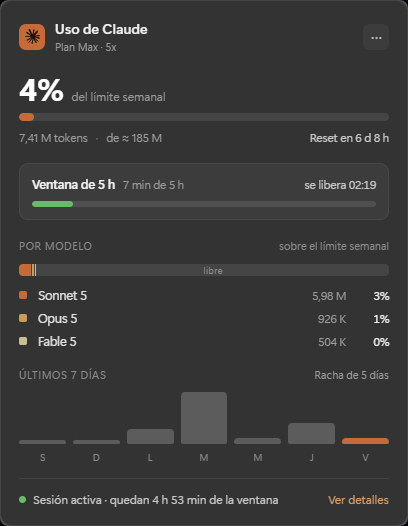
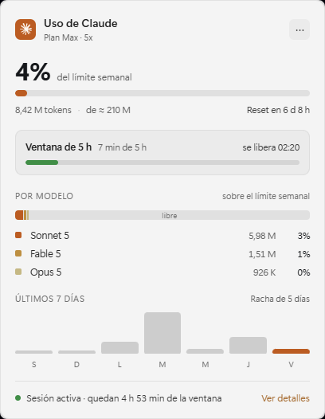
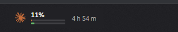

<div align="center">

# Claude Usage Widget

**Widget nativo para la barra de tareas de Windows 11 con el uso de tu plan
de Claude — la ventana de 5 horas y el límite semanal, en vivo, donde ya
estás mirando.**

[English](README.md)


<br>

 

Una pastilla que vive *dentro* de la barra de tareas…



…y se expande en un flyout estilo Fluent.

</div>

---

## Características

- **Pastilla en el taskbar** — spark de Claude, porcentaje de la sesión,
  mini-barras gemelas (semanal / sesión) y cuenta regresiva hasta que se
  libere la ventana de 5 horas. Es una *ventana hija real de la barra*, no
  un overlay flotante: nunca pelea el z-order con el shell y desaparece
  junto con la barra cuando un juego o video entra en pantalla completa.
- **Panel flyout** — límite semanal con progreso y reset, tokens locales con
  límite estimado, tarjeta de la ventana de 5 h, **desglose por modelo**,
  gráfico de los últimos 7 días con racha de uso y footer de estado en vivo.
- **Look nativo de Windows 11** — acrílico, esquinas redondeadas, animaciones
  de entrada/salida, hover, y tema claro/oscuro (sigue a Windows o manual).
  La pastilla muestrea los píxeles reales del taskbar para fundirse con él
  bajo cualquier color de acento.
- **Números oficiales** — la utilización viene del mismo endpoint OAuth que
  lee `/usage` de Claude Code. Las estadísticas por modelo y por día se
  agregan de tus transcripts locales (incremental, con deduplicación).
- **Manejo respetuoso del token** — un token expirado se renueva invocando
  el CLI oficial (`claude -p .`), nunca llamando al endpoint de refresh
  directamente, así tu sesión de Claude Code jamás se invalida.
- **Autostart confiable** — "Iniciar con Windows" registra una Tarea
  Programada por usuario con 10 s de retraso (la clave `Run` del registro es
  saltada silenciosamente por SmartScreen para ejecutables sin firmar).
- Un solo ejecutable de ~7 MB. Go puro, **cero CGo**, sin frameworks; la
  única dependencia de runtime es WebView2, incluido en Windows 11.

## Cómo funciona

| Dato | Fuente |
| --- | --- |
| Utilización de sesión (5 h) y semanal, resets | `GET https://api.anthropic.com/api/oauth/usage`, autenticado con tu token OAuth local de Claude Code |
| Token OAuth, tier del plan (`Max · 5x`, …) | `%USERPROFILE%\.claude\.credentials.json` (lo escribe Claude Code) |
| Tokens por modelo, barras diarias, racha | Transcripts `%USERPROFILE%\.claude\projects\**\*.jsonl`, deduplicados por `message.id + requestId`, con caché por archivo |

El endpoint se consulta una vez por minuto (configurable) con backoff
automático ante rate limiting. Todo corre localmente; no se envía nada a
ningún lado salvo la consulta de uso al API de Anthropic.

## Requisitos

- Windows 11 (incluye el runtime WebView2).
- [Go](https://go.dev/dl/) ≥ 1.22 para compilar.
- [Claude Code](https://claude.com/claude-code) con sesión iniciada
  (`claude login`) — plan Pro, Max, Team o Enterprise.

## Compilar y ejecutar

```powershell
git clone https://github.com/Parms221/claude-usage-widget.git
cd claude-usage-widget
.\build.ps1          # go vet + go build (ventana, sin consola)
.\ClaudeUsageWidget.exe
```

`ClaudeUsageWidget.exe -debug` habilita las DevTools del WebView2 y log
detallado.

## Uso

- **Clic en la pastilla** abre el panel; clic en cualquier otro lado, `Esc`
  o clic en la pastilla de nuevo lo cierran.
- **Menú ⋯** — actualizar ahora, tema (Auto / Oscuro / Claro), iniciar con
  Windows, salir.
- **"Ver detalles"** abre la configuración de uso en claude.ai.

## Configuración

`%APPDATA%\ClaudeUsageWidget\config.json` (se crea al primer arranque):

| Campo | Default | Descripción |
| --- | --- | --- |
| `theme` | `auto` | `auto` sigue a Windows; `dark` / `light` lo fijan |
| `overlayTaskbar` | `true` | Pastilla integrada en el taskbar; `false` la hace flotar sobre el área de trabajo |
| `marginX` | `16` | Separación izquierda en px lógicos |
| `pollSeconds` | `60` | Intervalo de consulta del endpoint |
| `historyDays` | `15` | Ventana de escaneo de transcripts (acota la racha) |
| `autoRefreshCli` | `true` | Permite `claude -p .` para renovar token expirado |
| `acrylic` | `true` | Acrílico nativo de Win11 tras el panel |
| `planLabel` | — | Sobrescribe la etiqueta del plan |

Log: `%APPDATA%\ClaudeUsageWidget\widget.log`.

## Arquitectura

```
main.go                  wiring: instancia única, DPI, poller, view-model
internal/winutil         Win32 puro: creación frameless (hook CBT), esquinas y
                         acrílico DWM, parenting al taskbar, overlay de input,
                         subclassing, tarea programada, tema del SO, muestreo
                         de píxeles de pantalla
internal/auth            credenciales de Claude Code + refresh vía CLI
internal/api             cliente del endpoint OAuth de uso
internal/history         agregación de transcripts (por modelo / día / racha)
internal/vm              construcción del view-model y formatos
internal/ui              dos ventanas WebView2 (pastilla + panel), bindings
internal/ui/assets       widget.html — toda la UI, oscuro + claro
```

Dos ventanas renderizan el mismo HTML embebido en modos distintos:

- La **pastilla** vive como hija de `Shell_TrayWnd` (`SetParent`): detección
  de pantalla completa, z-order y auto-ocultado vienen gratis. El taskbar
  XAML de Win11 se traga el input de composición de WebView2, así que un
  overlay Win32 clásico invisible (layered, alpha 1) sobre la pastilla
  releva el mouse a la página — todo por eventos, sin polling ni hooks
  globales.
- El **panel** es un flyout top-level normal: topmost mientras está abierto,
  se cierra al perder el foco o con `Esc`, se oculta con `SW_HIDE`. Además
  corre el message loop y recibe `TaskbarCreated`, recreando la pastilla si
  Explorer se reinicia.

Notas de implementación (las divertidas):

- La librería de ventanas muestra un marco antes de poder estilizarla; un
  **hook CBT** local al thread reescribe el `CREATESTRUCT` para que las
  ventanas nazcan frameless y fuera de pantalla — cero flash al arrancar.
- El look plano de la pastilla se logra **muestreando los píxeles reales del
  taskbar** (`GetPixel`) a su lado y usando ese color exacto de fondo
  (delta medido: 1/255 por canal).
- El fondo transparente de WebView2 se activa vía
  `ICoreWebView2Controller2::PutDefaultBackgroundColor`, alcanzado por
  reflection sobre el controller no exportado de la librería.
- El loader de config tolera BOMs UTF-8, el regalo favorito de PowerShell 5.1.

## Solución de problemas

| Síntoma | Dónde mirar |
| --- | --- |
| La pastilla muestra `!` o "Inicia sesión" | Ejecuta `claude login`; el widget lee las credenciales de Claude Code |
| "Límite de consultas · reintentando" | Rate limit del endpoint (429); el widget espera 5 min y se recupera solo |
| No arrancó al iniciar sesión | Programador de tareas → `ClaudeUsageWidget` muestra el último resultado |
| Cualquier otra cosa | `%APPDATA%\ClaudeUsageWidget\widget.log`, o ejecuta con `-debug` |

## Créditos

- Enfoque de monitoreo inspirado en
  [Claude-Code-Usage-Monitor](https://github.com/CodeZeno/Claude-Code-Usage-Monitor).
- Bindings de WebView2: [jchv/go-webview2](https://github.com/jchv/go-webview2).
- UI diseñada con [Claude Design](https://claude.ai); path del spark de
  [Simple Icons](https://simpleicons.org/).

## Descargo

Herramienta **no oficial**, hecha por la comunidad. No está afiliada,
respaldada ni patrocinada por Anthropic. "Claude" y el logo spark de Claude
son marcas de Anthropic, PBC, usadas aquí únicamente para identificar el
servicio que el widget reporta.

## Licencia

[MIT](LICENSE)
